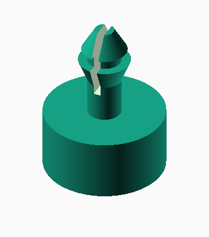
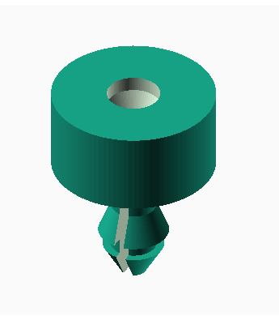

# snapfit-scad

**snapfit-scad** is a simple OpenSCAD library designed to create snap-fit components. It allows for easy parameterization and customization of snap-fit designs, making it useful for rapid prototyping and 3D printing. The library provides both positive and negative snap-fit modules, which can be integrated into various projects.




## Table of Contents
- [Features](#features)
- [Installation](#installation)
- [Usage](#usage)
  - [Example](#example)
- [Parameters](#parameters)
- [License](#license)

## Features
- **Easy Parameterization:** Adjust diameter, lip size, tolerance, slot ratio, and more.
- **Positive & Negative Snap-Fits:** Includes both types for flexible design integration.
- **Modular Components:** Snap-fit head, foot, and column can be customized individually.

## Installation

Clone the repository or download the library files directly to your OpenSCAD libraries folder:
```
git clone https://github.com/cameronbrooks11/snapfit-scad.git
```

Use the library in your OpenSCAD project:
```
use <snapfit-scad/snapfit.scad>;
```

## Usage

The library includes two main modules:
1. **snapfit:** Creates the positive snap-fit component.
2. **snapfit_neg:** Creates the negative counterpart for interfacing with the positive snap-fit.

### Example

```
use <snapfit-scad/snapfit.scad>;

// Parameters
w = 10;   // Base cylinder diameter
h = 5;    // Base cylinder height


dia = 3;	// Snap fit diameter
lip = 0.75;	// Snap fit lip (adds to diameter)
col_h = dia * 2;   // Snap fit column height

slot_ratio = 0.7;  // Snap fit slot ratio

col_tol = 0.1;  // Snap fit column tolerance
neg_tol = 0.5;  // Snap fit tolerance for the negative

// If defined, creates a foot for the snapfit, leaving a  
// gap of 'thickness' from the bottom of the column head
thickness = 1; 

$fn = 64; // Number of facets for the cylinder

z_fite = $preview ? 0.05 : 0.0;  // Z offset for preview

difference() {
    union() {
        cylinder(r = w/2, h = h, center = true); // Main cylinder
        translate([0, 0, h/2])
        snapfit(dia, lip, col_h, col_tol, slot_ratio, thickness=thickness);
    }

    translate([0, 0, -h/2 - 0.1]) 
    snapfit_neg(dia, lip, col_h, neg_tol, slot_ratio, thickness=thickness);
}
```

## Parameters

### snapfit
| Parameter          | Description                              | Default |
|--------------------|------------------------------------------|---------|
| `diameter`         | Base diameter of the snap-fit            | `3`     |
| `lip`              | Lip size, adds to diameter               | `0.75`  |
| `column_height`    | Height of the column                     | `6`     |
| `column_tolerance` | Tolerance for the column                 | `0.1`   |
| `slot_ratio`       | Ratio of the slot cut                    | `0.7`   |
| `thickness`        | Optional foot thickness                  | `undef` |

### snapfit_neg
| Parameter          | Description                              | Default |
|--------------------|------------------------------------------|---------|
| `diameter`         | Base diameter of the snap-fit            | `3`     |
| `lip`              | Lip size, adds to diameter               | `0.75`  |
| `column_height`    | Height of the column                     | `6`     |
| `negative_tolerance`| Tolerance for the negative snap-fit     | `0.5`   |
| `slot_ratio`       | Ratio of the slot cut                    | `0.7`   |
| `thickness`        | Optional foot thickness                  | `undef` |
| `flip`             | Flips the orientation of the component   | `false` |

## License

Adapted by Cameron K. Brooks from [Thingiverse](https://www.thingiverse.com/thing:1799553/files) on 2024-01-26 and 2024-10-20.
